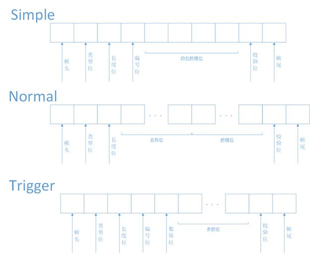

# 2023暑假控制组单片机方向线上测试

## 第一周测试题

### 1.git基本操作

#### 任务简介

> Git是一个开源的分布式版本控制系统，用于敏捷高效地处理任何或小或大的项目,可以帮助你进行自动的版本管理。控制组单片机端**之后的线上测试都是通过`gitee`发布**，在多人协作的情况下，使用`git`就会相当的方便，能够有效地协调多位开发者对不同地方的改动。

#### 任务要求

- 安装git，并且注册好`gitee`账户与`git`绑定，并且点击[**邀请链接**](https://gitee.com/buaarobot_admin/ControlGroupOnlineTest2023/invite_link?invite=a52b4b8233cdc27b4908272c9dc1ff6e99e49af97d700d63b7993663152babc580fd2afce6134a2c03eac9232b9ccfc5)加入本远程仓库
- 注意邀请链接的有效期为3天
- 在想要克隆本仓库的地方，右键菜单点击“**`Git Bash Here`**”，输入以下代码，即可实现将远程仓库克隆到本地的操作，注意**之后的任务会放置在任务文件夹中**

```c
>>> git clone https://gitee.com/buaarobot_admin/ControlGroupOnlineTest2023.git
```

- 创建一个markdown文件，命名格式为**{你的名字}.md**，如`李明.md`  撰写你对本周题目的难度的看法，创建一个简述自己对**git组成以及常见命令使用原理的理解**的markdown文件，命名格式为 **{你的名字ToMarkDown}.md** ，如`李明ToMarkDown.md`。  
  两个文件统一放到`ControlGroupSCMOnlineTest2023/第一周测试题/task1`下面  
- `git commit -m {改动的内容}` 在这里写清这次提交改动的内容:**{你的名字}提交task1**   
- 本任务结果提交方式为<font color='black'>**git提交**</font>   

##### 提示信息

- 可以使用`git push` 将本地所有未上传的提交推送到远程仓库
- 此时有可能会提示推送失败，这是因为远程仓库里面有本地未获取的提交
- 此时需要先`git pull`获取当前远程仓库的最新版本， 将远程仓库的最新版本和本地最新版本合并(`merge`)后，才能够推送 
- 第一次进行提交操作时需要登记提交者信息，提交时`git`会有相关的操作说明
- 更多详细的`git`用法请查询参考资料或借助网络搜索  

##### 注意

<font color="black" size=3>**不是**所有任务都需要利用git进行提交，第一周以及以后的其它任务提交方式**请以对应的任务说明为准**</font>

#### 参考资料

- [<u>git入门教程</u>](https://www.cnblogs.com/imyalost/p/8762522.html)
- [菜鸟教程yyds](https://www.runoob.com/git/git-tutorial.html)
- 一个可以打开md文件的软件：[Typora](https://bhpan.buaa.edu.cn:443/link/5D15F20C387C3E8D482B1A2AF01EC387)

### 2.PID控制程序编写及封装

#### 任务简介

> PID算法是控制领域应用最广泛的算法，其计算流程与其应用场景并无关系，为了避免重复编写同样的代码，我们往往会将PID算法进行封装，初始化过后直接调用即可。

#### 任务说明

1.请完善`PID.c`中的两个空白函数，函数的功能已经在注释中写出。

`void PID_StructInit(PID_t *pid, float p, float i, float d, float integral_limit, float max_output)`

`static void Calculate(PID_t *pid, float current_value, float target_value)`

2.请根据自己编写好的函数进行对`PID.c`的封装。
    需要达到的**要求**是用户在定义 `PID_t` 结构体后(例如 `PID_t TestPID`)，先运行`PID_StructInit`函数，再使用`TestPID.f_Calculate(&TestPID, Current_value, Target_value)`即可完成计算，计算的结果保存在结构体中。

3.通过查阅关于`PID`的资料，说一说P、I、D三个参数分别有什么作用，如果让你调节PID参数，你会如何开始调节。写成一个`.md`文档，字数不超过100字，以自己的名字命名即可。

4.本任务的代码均放在 `第一周测试题/task2`文件夹下。

#### 任务要求

- 需要提交的文件：`PID.c`和`PID.h`和`PID参数说明文档`。
- 程序有一定可读性，包含适当的注释；**即使没能完成任务，也请提交上来**，并且在同目录下创建一个README文本文件中写明原因以及完成的进度情况。
- 本任务提交方式为<font color='black'>**邮箱提交**</font>，邮箱为`bhjqrdkzz2022@163.com`(与其他需要邮箱提交的任务放在**同一个zip文件**中，zip文件命名格式为 **{你的名字}第一周测试题.zip** )
- 提交的文件放在`/task2`文件夹下

#### 参考资料

- [初识PID-搞懂PID概念](https://zhuanlan.zhihu.com/p/74131690)

### 3. 简单帧

#### 任务简介

> 通信协议是指在通信过程中双方遵循的规则和约定，包括数据格式、传输方式、错误处理等内容。没有通信协议，通信双方无法理解对方发送的信息，也无法进行正确的数据传输和处理。因此，通信协议是通信过程中必不可少的一部分。

#### 任务说明

1. 在机器人队遥控器与下位机STM32F407之间的通信协议中规定了三种数据帧，由起始位、帧类型、数据位和校验位等组成，示意图如下所示：



Simple帧是三种数据帧最简单的一种帧，其作用是修改远端指定编号变量的值，其每一位参数如下：

- 帧头：0x7E
- 类型位：0x00（可以此判断为简单帧）
- 长度位：0x05（编号位和数据位的总长度）
- 编号位：本题中为0x01或0x02
- 数据位：

  - size:4

  - type:本题中为float或int型(4字节数据类型)
  - **小端模式**
- 校验位：一字节，通过校验和计算获得
  - 计算方法：把从类型位到数据位之间的位全部求和，求和值舍弃溢出的高位
- 帧尾：0x30

2. 简单帧发送

假设在本次调试过程中，需要修改远端两个变量（编号1变量：float型；编号2变量：int型），请完善`void SendSimpleFrame(uint8_t id, ...)`函数。

3. 简单帧接收

当接收到一帧后，需要调用接收处理函数读取其中包含的信息。在简单帧接收处理函数`void SimpleFrameHandler(uint8_t *recv_frame, uint16_t len)`中，需要完成以下任务，请以此完善该函数：

- 判断是否为完整的一帧
- 重新计算校验值，判断有无接收错误
- 判断帧的长度是否正确
- 若前项均正确，根据编号位的值正确读出数据位的值

4. 本任务的代码放在 `第一周测试题/task3`文件夹下。

##### 任务提示

- 由于发送数据的类型不确定，发送函数需要使用可变参数，具体实现可以参考以下资料。
- 注意，int和float型变量为4字节，而一般的通信过程都需要将其拆分为单字节进行传送。int型的转换较简单，通过移位操作（>>）即可实现，float型不建议通过转换为int的方法发送，这样会损失精度，具体实现可以参考以下资料。

#### 任务要求

- 需提交`frame.c`文件
- 程序有一定可读性，包含适当的注释；**即使没能完成任务，也请提交上来**，并且在同目录下创建一个README文本文件中写明原因以及完成的进度情况。
- 本任务提交方式为<font color='black'>**邮箱提交**</font>，邮箱为`bhjqrdkzz2022@163.com`(与其他需要邮箱提交的任务放在**同一个zip文件**中，zip文件命名格式为 **{你的名字}第一周测试题.zip** )
- 提交的文件放在`/task3`文件夹下

#### 参考资料

- [C语言可变函数参数 - 哔哩哔哩](https://www.bilibili.com/read/cv20412768)

- [技术分享 | float类型与uint8数组的相互转换-CSDN博客](https://blog.csdn.net/msq19895070/article/details/122876298)

- [关于C ++:将*float转换为*4 *uint8_t* | 码农家园](https://www.codenong.com/25386503/)

### 4.UDP通信

#### 任务简介

> Qt 是一个跨平台的 C++ 框架，可以用来开发Windows系统图形用户界面。北航机器人队的遥控器采用Qt开发，通过Wifi与下位机STM32F407之间建立连接，使用UDP（**User Datagram Protocol，用户数据报协议**）协议传输数据。

#### 任务说明

1. 利用Qt实现可以发送和接收UDP数据包的应用程序

2. **要求**

- **只**需要实现下述基本功能：设置远端ip，远端端口，本地端口，开始连接，断开连接，发送接收。
- 需要有发送框和接收框，点击发送将发送框中的内容发出，接收的内容显示在接收框中。
- （可选）实现简单帧通信

#### 任务要求

- 需提交完整的**QT工程文件**
- 程序有一定可读性，包含适当的注释；**即使没能完成任务，也请提交上来**，并且在同目录下创建一个README文本文件中写明原因以及完成的进度情况。
- 本任务提交方式为<font color='black'>**邮箱提交**</font>，邮箱为`bhjqrdkzz2022@163.com`(与其他需要邮箱提交的任务放在**同一个zip文件**中，zip文件命名格式为 **{你的名字}第一周测试题.zip** )
- 提交的文件放在`/task4`文件夹下

#### 参考资料

- [基于QT的UDP通信_qtudp通信](https://blog.csdn.net/weixin_43479242/article/details/126995697)
- [QT下载参考链接](http://c.biancheng.net/view/3851.html)
- [【Qt5】入门Qt开发教程](https://blog.csdn.net/qq_33904382/article/details/111369153)
- [C++总结（三）——类与对象](https://zhuanlan.zhihu.com/p/619050568)

